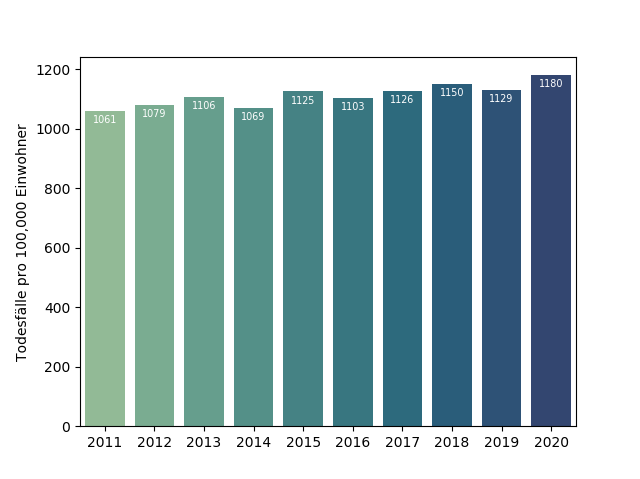
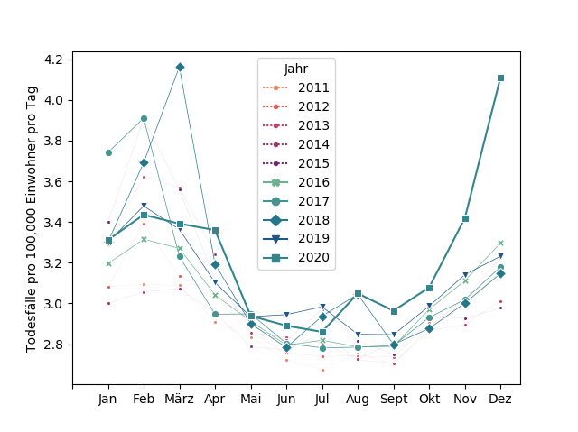
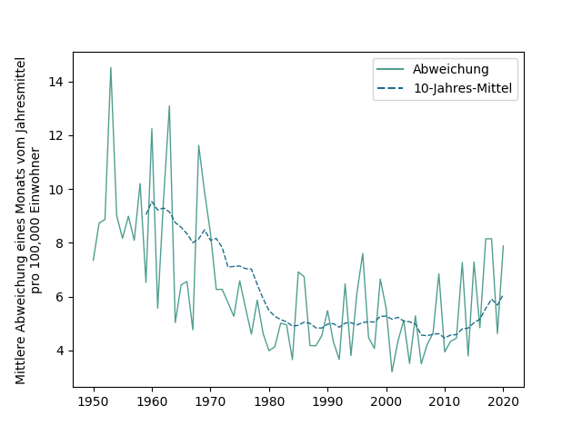
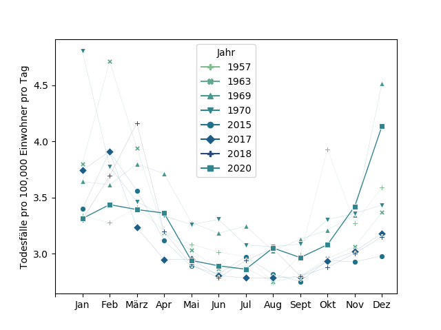

# Sterblichkeit in Deutschland im Jahr 2020 verglichen mit den Vorjahren

Stand: 23.01.2021

## Jahressterblichkeit 2011-2020

Dieses Schaubild zeigt die Anzahl Gestorbener in Deutschland der letzten zehn Jahren, normalisiert pro 100,000 Einwohner.
2020 hatte die höchste Sterblichkeit der letzten zehn Jahre. 
Allerdings lässt sich in der letzten Dekade ein genereller Anstieg der Sterblichkeit beobachten, 2020 scheint diesen Trend nur fortzusetzten. 
Aber natürlich gab es im Jahr 2020 die verschiedenen Corona-Lockdowns; ohne diese wären die Zahlen wohl höher.

Zu beachten ist auch, dass für Dezember 2020 noch keine endgültigen Sterblichkeitszahlen vorliegen.
Der Bevölkerungsstand 2020 ist ebenfalls noch nicht offiziell ermittelt.
Beide Werte wurden also geschätzt.
Sobald die vollständigen Zahlen vorliegen, wird dieses Schaubild, ebenso wie die Folgenden, aktualisiert.

## Monatssterblichkeit 2011-2020

Dieses Schaubild zeigt die durchschnittlichen täglichen Sterbezahlen der letzten zehn Jahre, für jeden Monat, ebenfalls pro 100,000 Einwohner.
Zu erkennen ist, dass wir in den vergangenen zehn Jahren immer wieder erhebliche Übersterblichkeiten in den Monaten Januar bis März hatten.
Für das Jahr 2020 fällt auf, dass die Zahlen ab September über denen aller neun Vorjahre liegen. 
Verglichen mit dem Vorjahr 2019 sind die Steigerungen in den letzten vier Monaten wie folgt:

|            | Sept | Okt  | Nov  | Dez  |
|:-----------|:-----|:-----|:-----|:-----|
| 2019       | 2,84 | 2,98 | 3,14 | 3,23 | 
| 2020       | 2,96 | 3,07 | 3,41 | 4,11 |
| Steigerung | 4,2% | 3,0% | 8,5% | 27,2%|

## Abweichung vom Mittel 1950-2020

Für dieses Schaubild wurde die mittlere monatliche Abweichung eines jeden Jahres berechnet.
Dafür wurde, für jedes Jahr, der durchschnittliche Monatswert ermittelt.
Die absoluten Differenzen der einzelnen Monate zum Jahresmittel wurden dann aufsummiert und durch 12 geteilt.
Der Hintergrund ist, dass Jahre mit einer gleichmäßigen Verteilung der Toten für ein Gesundheitssystem einfacher zu händeln sein sollten als Jahre mit großen Unterschieden.
(Natürlich spielen hierfür auch andere Faktoren eine Rolle, z.B. die Art der vorherrschenden Erkrankungen.
Generell sind Vergleiche über lange Zeiträume immer etwas problematisch. Im konkreten Fall beziehen sich die Zahlen vor
1990 auf die BRD und die DDR, also zwei völlig unterschiedliche Gesundheitssysteme.
Man kann auch annehmen, dass sich die Qualität unseres Gesundheitssystems über die Jahrzente hinweg deutlich verbessert hat.)

Es ist zu erkennen, dass es in manchen Jahren erhebliche Schwankungen zwischen den einzelnen Monaten gab.
In anderen Jahren ist die Schwankung erheblich geringer.
Die Schwankungen 2020 waren deutlich höher als 2019, aber etwas geringer als 2017 und 2018.
Das Schaubild legt auch nahe, dass es, spätestens ab 2010, einen generellen Trend zurück zu volatileren Jahresverläufen gibt.

## Monatssterblichkeit ausgewählter Jahre

Basierend auf dem letzten Schaubild, wurden für dieses Schaubild sieben Jahre ausgewählt,
die eine besonders hohe Volatilität aufwiesen und mit dem Jahr 2020 verglichen.
Es ist zu sehen, dass wir auch in der Vergangenheit teilweise erhebliche Übersterblichkeiten in einzelnen Monaten hatten.
Für einige Jahre sind die Ursachen leicht recherchierbar:
* 1957: [Asiatische Grippe](https://de.wikipedia.org/wiki/Asiatische_Grippe)
* 1969/1970: [Hongkong-Grippe](https://de.wikipedia.org/wiki/Hongkong-Grippe)
* 2018: [Grippesaison 2017/2018](https://de.wikipedia.org/wiki/Grippesaison_2017/2018)

Einerseits fällt das Jahr 2020 in der Reihe dieser außergewöhnlichen Jahre nicht durch besonders hohe Ausschläge auf.
Andererseits lässt die Tatsache, dass die größten Ausschläge gewöhlich in den Monaten Januar bis März auftreten,
eventuell nichts Gutes für den Beginn des Jahres 2021 erwarten.
Hoffnungsvoll stimmt, dass momentan die Anzahl der Corona-Toten leicht zurückgeht,
was wahrscheinlich auf den momentanen Lockdown zurückzuführen ist.

## Quellen
* Sterbezahlen 1950-2019: https://www-genesis.destatis.de/genesis/online?operation=table&code=12613-0006
* Sterbezahlen 2020: https://www.destatis.de/DE/Themen/Gesellschaft-Umwelt/Bevoelkerung/Sterbefaelle-Lebenserwartung/Tabellen/sonderauswertung-sterbefaelle.html
* Bevölkerung 1950-1989: https://de.wikipedia.org/wiki/Demografie_Deutschlands#Demografie_seit_1900
* Bevölkerung 1990-2019: https://www-genesis.destatis.de/genesis/online?operation=table&code=12411-0001
* Bevölkerung 2020: Es wurden dieselbe Zahl wie 2019 angenommen, siehe: https://www.destatis.de/DE/Presse/Pressemitteilungen/2021/01/PD21_016_12411.html

Der Python Code für die Datenanalyse und die Erstellung der Schaubilder befindet sich 
[hier](https://github.com/txtData/mortality/blob/main/mortality.py). 

